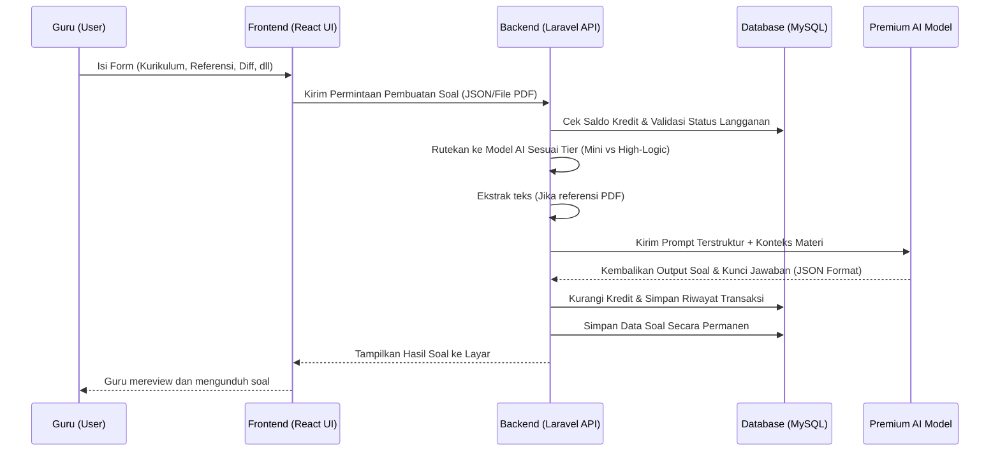
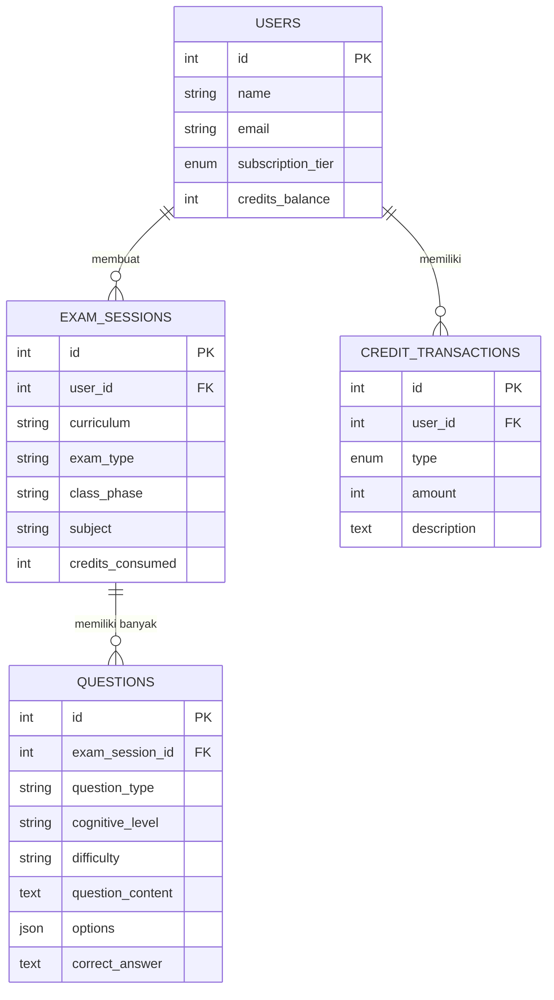

# PRD — Project Requirements Document

## 1. Overview
Pembuatan soal ujian semester seringkali menjadi beban administratif yang sangat menyita waktu bagi guru SD, SMP, dan SMA. Mereka menghabiskan berjam-jam hanya untuk mencari referensi, mengetik soal, dan memastikan soal sesuai dengan standar kurikulum serta Taksonomi Bloom. 

Aplikasi **Soalify** hadir sebagai solusi berbasis web untuk mengotomatiskan pembuatan soal ujian. Dengan aplikasi ini, guru dapat menghasilkan puluhan soal secara instan berdasarkan kurikulum, jenis ujian, referensi materi (PDF/Teks/AI), dan tingkat kognitif yang spesifik. Tujuan utamanya adalah memberikan *Unique Selling Point* berupa kecepatan yang luar biasa, memangkas waktu kerja dari hitungan jam menjadi hitungan menit, dan menghemat tenaga guru dari mengetik manual.

## 2. Requirements
*   **Aksesibilitas:** Aplikasi berbasis web browser yang responsif (dapat diakses via laptop/PC yang biasa digunakan guru).
*   **Integrasi AI Premium:** Menggunakan model AI canggih untuk memastikan kualitas soal (struktur kalimat, tingkat kognitif C1-C6, dan relevansi kurikulum) sangat tinggi.
*   **Pemrosesan Dokumen:** Kemampuan sistem untuk membaca materi dari file PDF yang diunggah pengguna.
*   **Pengaturan Kustom:** Form dinamis yang dapat menyesuaikan input berdasarkan pilihan (contoh: jika memilih PG, muncul opsi jumlah pilihan ganda A-C, A-D, atau A-E).
*   **Output Siap Pakai:** Hasil *generate* soal harus bisa ditinjau, diedit, dan diekspor (diunduh) untuk dicetak atau digunakan di kelas.
*   **Sistem Kredit & Kuota:** Integrasi sistem penagihan dan pengurangan kredit otomatis setiap kali proses generate soal dilakukan. Sistem harus menangani batas kuota harian/bulanan dan memberikan notifikasi *upgrade* saat kredit habis.
*   **Diferensiasi Model AI:** Kemampuan backend untuk merutekan 요청 generate ke model AI yang berbeda berdasarkan tier akun pengguna (model efisien untuk akun dasar, model *high-logic* untuk akun premium) guna mengoptimalkan rasio biaya dan kualitas.

## 3. Core Features
*   **Wizard Konfigurasi Dasar:** 
    *   Pilihan Kurikulum (Merdeka Deep Learning, K13, KBC/Madrasah, Hybrid).
    *   Jenis Ujian (Ujian Sekolah, SAS, STS, dll).
    *   Info Kelas (Fase/Kelas 1-12, Mata Pelajaran, Semester, durasi ujian).
*   **Input Materi & Tujuan:** Form dinamis untuk memasukkan Topik Pembelajaran dan Tujuan Topik (bisa lebih dari satu).
*   **Manajemen Sumber Referensi:** Pengguna dapat memilih sumber materi dari: AI Premium, Unggah PDF materi, atau input teks manual.
*   **Personalisasi Soal Lanjutan:**
    *   Tingkat Kesulitan: Mudah (LOTS), Sedang, Sulit (HOTS), Campuran.
    *   Level Kognitif (Taksonomi Bloom): Multi-select C1 hingga C6.
    *   Format & Jumlah Soal: Kombinasi PG, PG Kompleks, Menjodohkan, Benar/Salah, Isian, Uraian.
    *   Opsi PG khusus: Pilihan 3 (A-C) untuk kelas bawah, 4 (A-D) untuk menengah, 5 (A-E) untuk atas.
*   **Toggle Gambar Ilustrasi (On/Off):** Fitur untuk meminta AI menyertakan ide/prompt gambar ilustrasi pada soal tertentu jika diperlukan.
*   **Review & Export:** Tampilan untuk membaca hasil soal dari AI, mengedit teks jika ada yang kurang sesuai, dan mengekspor ke format dokumen.
*   **Ekspor Profesional (.docx) [Eksklusif Berbayar]:** Fitur untuk mengunduh paket soal beserta kunci jawaban dalam format Microsoft Word (.docx) yang sudah memiliki tata letak, *header*, *footer*, dan margin siap cetak standar sekolah. Fitur ini hanya tersedia bagi pengguna dengan status berlangganan aktif.

## 4. Monetization & Business Model
Aplikasi ini menerapkan model bisnis *Freemium* yang dikombinasikan dengan sistem kredit mikro untuk memastikan keberlanjutan operasional dan biaya API AI.

*   **Model Freemium (Free Tier):** 
    *   Pengguna baru mendapatkan **10 kredit gratis** sejak pertama kali mendaftar.
    *   1 Kredit = 1 butir soal yang berhasil di-*generate*.
    *   Akses terbatas hanya pada fitur dasar, ekspor format .txt, dan penggunaan model AI standar.
*   **Paket Langganan (Subscription):**
    *   **Paket 6 Bulan & 12 Bulan:** Memberikan akses *unlimited* atau kuota sangat besar (bulk credits) untuk generate soal, prioritas penggunaan model AI tingkat tinggi, dan fitur ekspor profesional (.docx). Paket ini dirancang untuk menjaga stabilitas cash flow jangka panjang.
*   **Paket Top-up (Pay-per-Exam):**
    *   Tersedia pembelian kredit eceran (misal: Rp25.000 untuk 50 soal atau Rp40.000 untuk 100 soal). Opsi ini menjangkau guru yang membutuhkan solusi cepat di masa-masa padat (akhir semester) tanpa komitmen langganan panjang.
*   **Diferensiasi & Tiering Model AI:**
    *   **Akun Gratis/Dasar:** Sistem secara otomatis merutekan permintaan ke model AI yang lebih efisien dan murah (seperti GPT-4o-mini atau Gemini Flash) untuk mengurangi beban biaya operasional.
    *   **Akun Premium/Langganan:** Sistem merutekan permintaan ke model AI *high-logic* (seperti GPT-4o atau Claude 3.5 Sonnet) yang unggul dalam pemahaman konteks pedagogis, akurasi Taksonomi Bloom C1-C6, dan generasi soal HOTS yang kompleks.

## 5. User Flow
1.  **Mulai Cepat (First Win):** Pengguna masuk ke aplikasi dan langsung memilih **Kurikulum** serta melengkapi informasi dasar Kelas dan Jenis Ujian.
2.  **Tentukan Topik & Referensi:** Pengguna memasukkan Topik Pembelajaran dan memilih sumber materi (misal: Upload file PDF rangkuman buku cetak).
3.  **Tentukan Kriteria Soal:** Pengguna mengatur jumlah soal, format soal (PG/Uraian), tingkat kesulitan (LOTS/HOTS), dan level taksonomi (C1-C6). Pengguna juga menyalakan/mematikan tombol "Gambar Ilustrasi".
4.  **Cek Kredit & Validasi:** Sebelum menekan tombol "Buat Soal", sistem memeriksa saldo kredit pengguna. Jika cukup, proses dilanjutkan. Jika habis, sistem menampilkan *popup* penawaran paket langganan atau top-up kredit.
5.  **Generate AI:** Pengguna menekan tombol "Buat Soal". Sistem memproses data dan AI mulai merangkai pertanyaan dengan model sesuai tier akun. Kredit otomatis dikurangi.
6.  **Review (Return Reason):** Guru melihat hasil soal yang tercipta seketika. Guru dapat membaca dan mengedit sedikit jika diperlukan.
7.  **Selesai & Ekspor:** Guru mengunduh soal. Jika akun berbayar, opsi unduh .docx format sekolah tersedia. Jika gratis, hanya tersedia format .txt/.pdf dasar.

## 6. Architecture
Aplikasi ini memisahkan bagian depan (Antarmuka Pengguna/React) dan bagian belakang (Logika Server/Laravel). Laravel akan bertugas menyimpan histori soal ke database MySQL, mengelola logika pengurangan kredit, dan melakukan komunikasi dengan server AI Premium (sebagai pihak ketiga).

## 7. Database Schema
Untuk menyimpan histori aktivitas, memanajemen soal, dan melacak penggunaan kredit/biaya, berikut adalah struktur database utamanya:

### Tabel
1. **users:** Menyimpan data guru dan status akun/langganan.
   * `id` (PK, Int)
   * `name` (String)
   * `email` (String, Unique)
   * `password` (String)
   * `subscription_tier` (Enum: free, basic, premium)
   * `credits_balance` (Int)
   * `subscription_expiry` (Timestamp, Nullable)
2. **exam_sessions (Sesi Ujian):** Menyimpan metadata pengaturan satu paket soal ujian.
   * `id` (PK, Int)
   * `user_id` (FK, Int) - Relasi ke pengguna
   * `curriculum` (String) - K13, Merdeka, dll
   * `exam_type` (String) - SAS, STS, dll
   * `class_phase` (String) - Info fase/kelas
   * `subject` (String) - Mata Pelajaran
   * `time_allocation` (Int) - Menit
   * `reference_type` (String) - AI, PDF, Manual
   * `credits_consumed` (Int) - Jumlah kredit yang terpakai
   * `created_at` (Timestamp)
3. **questions (Detail Soal):** Menyimpan butir soal di dalam sebuah `exam_sessions`.
   * `id` (PK, Int)
   * `exam_session_id` (FK, Int)
   * `question_type` (String) - PG, Uraian, B/S, dll
   * `cognitive_level` (String) - C1, C2..C6
   * `difficulty` (String) - Mudah, Sedang, Sulit
   * `question_content` (Text) - Isi pertanyaan
   * `options` (JSON, Nullable) - Pilihan ganda jika ada (A, B, C, dll)
   * `correct_answer` (Text) - Kunci jawaban
   * `illustration_prompt` (Text, Nullable) - Saran gambar jika fitur ON
4. **credit_transactions (Log Keuangan):** Menyimpan riwayat masuk/keluarnya kredit.
   * `id` (PK, Int)
   * `user_id` (FK, Int)
   * `type` (Enum: topup, subscription, deduction, bonus)
   * `amount` (Int) - Jumlah kredit
   * `description` (Text)
   * `created_at` (Timestamp)

### ER Diagram

## 8. Tech Stack
Berdasarkan input sistem yang diminta, arsitektur teknis berjalan menggunakan kombinasi berikut:

*   **Frontend:** **React.js** (Rekomendasi dipadukan dengan Tailwind CSS untuk UI yang bersih dan form dinamis yang mulus).
*   **Backend API:** **Laravel** (Sangat handal untuk mengelola antrean pemrosesan AI, penguraian teks PDF, autentikasi, serta logika penagihan sistem kredit).
*   **Database:** **MySQL** (Relasional database yang stabil untuk data-data paket soal, user, dan log transaksi).
*   **Penyebaran / Deployment:** **VPS** (Bisa menggunakan layanan seperti Niagahoster, Hostinger VPS, atau DigitalOcean dengan setup Nginx/Apache).
*   **Rekomendasi AI PREMIUM:** 
    *   **Tier Premium/Langganan:** Saya sangat merekomendasikan **Anthropic Claude 3.5 Sonnet** atau **OpenAI GPT-4o**.
    *   *Alasannya:* Untuk menghasilkan soal dengan Taksonomi Bloom (C1-C6) yang akurat dan *format JSON* yang ketat, model dasar seringkali gagal mematuhi instruksi. Model ini memiliki kemampuan pedagogi dan literasi PDF sangat baik.
    *   **Tier Gratis/Basic:** Menggunakan **GPT-4o-mini** atau **Gemini Flash** untuk menekan biaya operasional (COGS) saat free trial, sambil tetap menjaga kualitas jawaban yang memadai.
